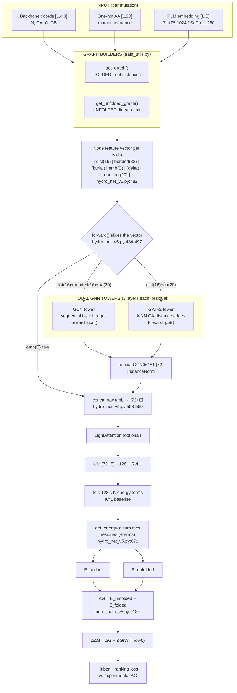
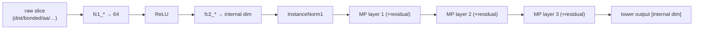

# DeepEF — Neural Network Architecture & Data Flow

**Model:** `ProteinEnergyModel` (PEM) — a dual-tower Graph Neural Network that predicts protein
folding free energy (ΔG) and stability change on mutation (ΔΔG) from 3D backbone coordinates +
protein-language-model embeddings.

Source of truth for this diagram: `DeepPEF_v5/model/hydro_net_v5.py` and
`DeepPEF_v5/training/pnas_train_v5.py` (verified against code, file:line noted inline).

---

## 1. Top-level thermodynamic idea

The model never predicts stability directly. It scores an **energy** for two states of the same
sequence and takes differences:

```
E_folded    = PEM( graph with REAL 3D contacts )
E_unfolded  = PEM( graph with linear-chain-only contacts )
ΔG          = E_unfolded − E_folded                 # per variant
ΔΔG         = ΔG_mutant − ΔG_wildtype               # = output − output[0], WT is row 0
```

- **Folded graph** = true pairwise atom distances (full contact map).
- **Unfolded graph** = same coordinates but distances zeroed except diagonal neighbours (a linear chain).
- The energy *difference* rewards forming 3D contacts vs. the extended-chain penalty.
- WT is always batch index 0, so `ΔΔG = output − output[0]` (`pnas_train_v5.py:687`, `:804-805`).

---

## 2. End-to-end data flow



---

## 3. Inside one GNN tower (detail)

Both towers share the internal dimension `gnn_internal_dim = 16 + aa_dim (=36 default)`.
GCN additionally consumes the 16 "bonded-to-previous" columns. `fc1_*` projects raw features →64,
`fc2_*` →internal dim, then InstanceNorm, then 3 residual message-passing layers.



- **GCN edges** (`get_edge_index`): directed sequential `(i, i+1)` — the protein backbone chain
  (extended to span S both directions under Lever F).
- **GAT edges**: k-nearest-neighbour on **CA** atom distances (`_energy_split`, `pnas_train_v5.py:856-861`),
  so attention sees the spatial 3D neighbourhood; optional 41-dim edge features
  `[onehot_src(20)|onehot_dst(20)|CA-dist(1)]` under Lever F.

---

## 4. Node feature vector — the dimension contract

Every residue is one node. The feature vector layout (`hydro_net_v5.py:482`), default widths:

| Block | Width | Meaning | Consumed by |
|---|---|---|---|
| dist | 16 | Gaussian-kernel pairwise distance features (non-bonded) | GCN + GAT |
| bonded | 32 | bonded features (GCN uses first 16) | GCN |
| burial *(opt, Lever C)* | 0/1 | per-residue CB neighbour density | both towers |
| emb | E = 1024 (ProtT5) / 1280 (SaProt) | PLM per-residue embedding — main mutation signal | post-GNN concat |
| delta *(opt, Lever G)* | 0/E | `emb_mut − emb_wt` mutation-delta | both towers |
| one_hot | 20 | amino-acid identity of this residue | GCN + GAT |

**fc1 input** = `gcn_out(36) + gat_out(36) + emb(E)` = **1096** for ProtT5 (E=1024).
Every optional lever's default reproduces the baseline shape bit-for-bit.

---

## 5. Why ΔΔG is hard (the diagnosed bottleneck)

Because the **structure is identical** across a protein's variants, the `dist(16)+bonded(32)`
geometry blocks are the same in WT and mutant → they **cancel in ΔΔG**. The mutation signal
therefore flows only through the `one_hot(20)` + PLM `emb(E)` blocks. ΔΔG becomes a *tiny difference
of two length-L energy sums*, which compresses the response (low slope). This is the motivation for
the planned upgrades: structure-aware embeddings (SaProt/ESM-IF), a **local mutation-site readout**
(instead of the whole-protein sum), and per-residue burial features.

---

## 6. Key source anchors

| Component | File:line |
|---|---|
| Model class `ProteinEnergyModel` | `hydro_net_v5.py` |
| `forward()` — slicing + towers + readout | `hydro_net_v5.py:462-591` |
| Node layout comment | `hydro_net_v5.py:482` |
| GCN tower | `hydro_net_v5.py:611-624` |
| GAT tower | `hydro_net_v5.py:593-609` |
| Edge construction (GCN seq / GAT k-NN) | `hydro_net_v5.py:678+`, `pnas_train_v5.py:856-861` |
| `get_energy()` (sum → ΔG term) | `hydro_net_v5.py:655-676` |
| ΔG = unfolded − folded | `pnas_train_v5.py:918` |
| ΔΔG = output − output[0] (WT=row0) | `pnas_train_v5.py:687`, `804-805` |
